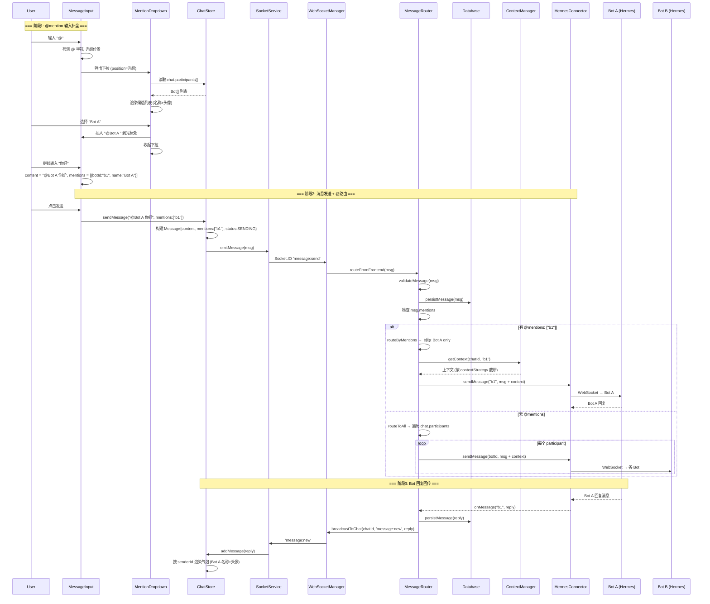
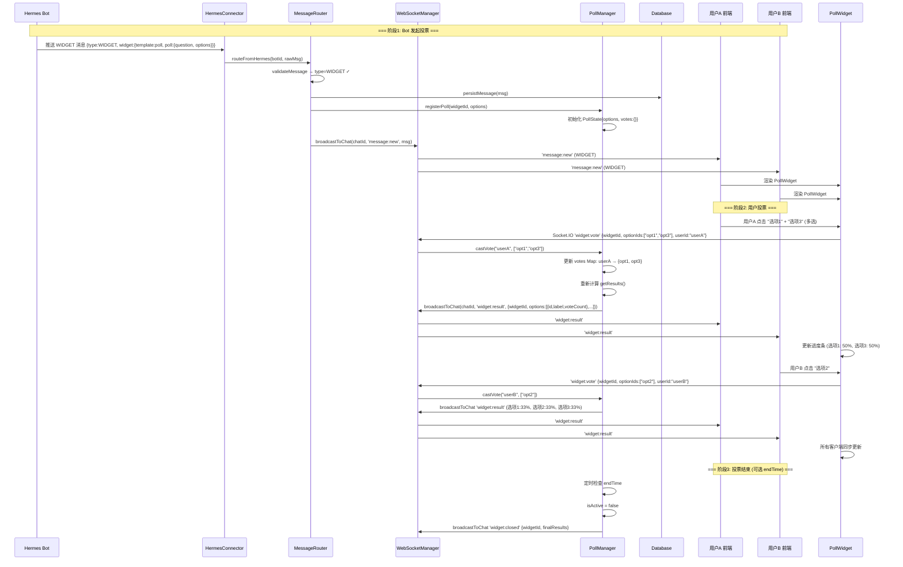
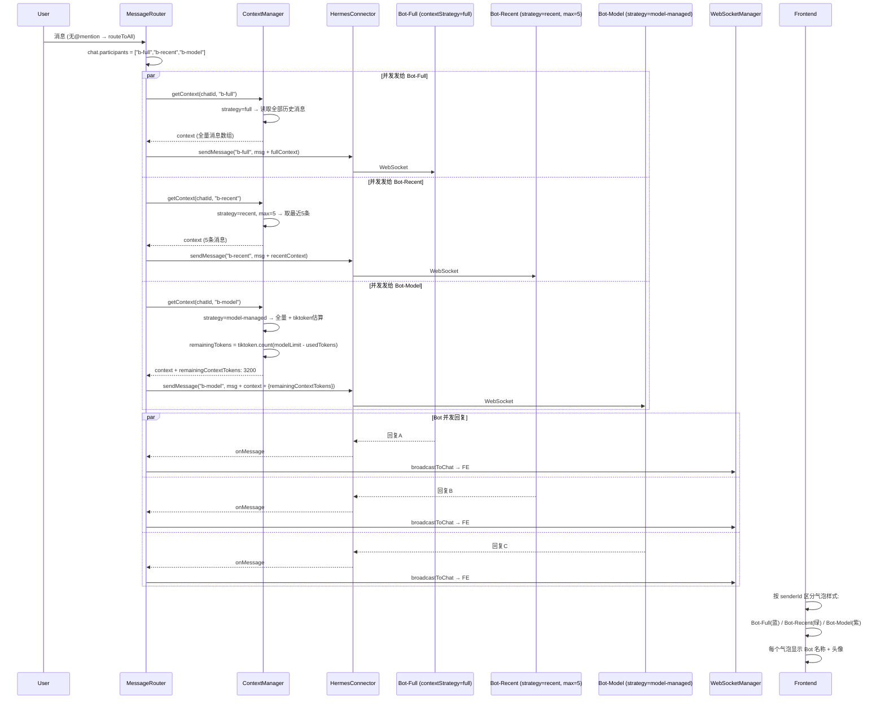
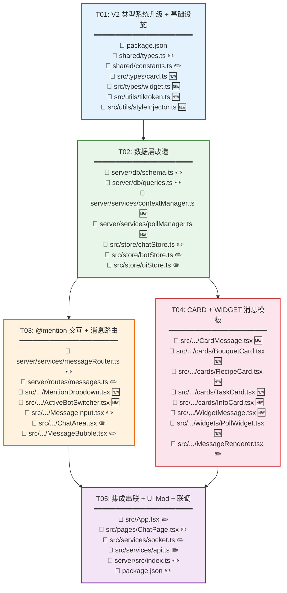

# Hermes Chat V2 — 增量系统架构设计

> **文档版本**: v2.0  
> **作者**: Bob (Architect)  
> **日期**: 2025-07-15  
> **项目代号**: `hermes-chat-v2`  
> **基线**: 基于 V1 (`hermes-chat`) 增量改造，70% 代码复用

---

## Part A: 增量系统设计

---

### 1. 增量实现方案

#### 1.1 复用策略总览

```
┌──────────────────────────────────────────────────────────────┐
│                    V1 代码库 (hermes-chat)                     │
├──────────────────────────────────────────────────────────────┤
│  ████████████████████████  70% 完整复用                      │
│  ├── Layout 组件树 (AppLayout, TopNavbar, Sidebar, BottomNav) │
│  ├── 消息渲染体系 (Text/Markdown/Game/Progress/System)        │
│  ├── Socket.IO 基础设施 (socket.ts, websocketManager.ts)      │
│  ├── 数据库基础表 (connection, 基础 CRUD)                     │
│  ├── Auth / RateLimit / SSH Tunnel / Cron Scheduler           │
│  ├── 通用组件 (Avatar, Badge, Spinner, GameSandbox)           │
│  ├── Hooks (useChat, useSocket, useTheme, useResponsive)       │
│  ├── Services (api.ts, gameBridge.ts)                         │
│  └── Pages 结构 (ChatPage, BotsPage, TasksPage, SettingsPage)  │
├──────────────────────────────────────────────────────────────┤
│  ▓▓▓▓▓▓▓▓▓▓▓▓▓▓▓▓▓▓▓▓▓▓  20% 轻改动                        │
│  ├── shared/types.ts (+CARD/WIDGET, Chat多participants, etc.) │
│  ├── shared/constants.ts (+模板常量, 白名单)                  │
│  ├── store/* (chatStore多participant, botStore+context,       │
│  │           uiStore+新UIMod)                                 │
│  ├── MessageInput.tsx (+@mention补全)                         │
│  ├── ChatArea.tsx (+激活Bot切换)                              │
│  ├── MessageBubble.tsx (+Bot名称/头像)                        │
│  ├── MessageRenderer.tsx (+CARD/WIDGET分发)                   │
│  ├── server/db/schema.ts (+participants列, contextStrategy)   │
│  ├── server/db/queries.ts (+多participant查询)                │
│  ├── server/routes/messages.ts (+@路由)                       │
│  └── server/services/messageRouter.ts (+@解析)                │
├──────────────────────────────────────────────────────────────┤
│  ░░░░░░░░░░░░░░░░░░░░░░░░  10% 纯新增                        │
│  ├── CARD 消息模板 (4种: bouquet/recipe/task/info)            │
│  ├── WIDGET 消息模板 (poll 投票)                              │
│  ├── @mention UI (MentionDropdown, ActiveBotSwitcher)         │
│  ├── 工具 (styleInjector, tiktoken)                           │
│  └── 服务 (contextManager, pollManager)                       │
└──────────────────────────────────────────────────────────────┘
```

#### 1.2 核心技术挑战 (V2 新增)

| 挑战 | 描述 | 应对策略 |
|------|------|---------|
| **@mention 解析与路由** | 消息文本中 `@BotName` 需准确提取 → 路由到被 @ 的 Bot，不 @ 则广播全部 | 前端用 `contenteditable` overlay + 正则匹配；后端解析 `@mentions[]` 元数据字段，按 `mentionedBotIds` 分发 |
| **CARD 安全渲染** | info 卡允许 HTML 子集，需防 XSS | 复用 V1 `DOMPurify` + ALLOWED_TAGS 白名单：`<b><i><u><a><ul><ol><li><br><p><span><h3><h4>`，禁止 `<script><iframe><style>` |
| **WIDGET 投票一致性** | 多客户端并发投票 + 结果实时同步 | V2-MVP 内存模式：服务端 `PollManager` (Map) 维护状态，Socket.IO 房间广播 `widget:result`；不持久化，重启丢失（按 PRD Q3） |
| **contextStrategy 多策略** | Bot 可声明 'full'/'recent'/'model-managed'，服务端需据此截断/组装上下文 | `ContextManager` 读取 Bot 配置 → full 全量传、recent 截 N 条、model-managed 透传 `remainingContextTokens`（tiktoken 估算） |
| **多 Bot 并发响应** | 同一 Chat 中多个 Bot 各自回复，消息顺序与归属需清晰 | 允许并发（PRD Q1），每条 Bot 消息独立 `senderId`，前端按 `senderId` 区分气泡样式+名称+头像 |

#### 1.3 V2 新增依赖选型

| 职责 | 选型 | 版本 | 理由 |
|------|------|------|------|
| Token 估算 | `tiktoken` (或 `js-tiktoken`) | ^1.0 | OpenAI cl100k_base 编码器，轻量 WASM 实现 |
| HTML 净化 | `dompurify` | ^3.1 | V1 已有，V2 info 卡复用 |
| UUID | `uuid` | ^10.0 | V1 已有，poll voteId 生成 |

---

### 2. V2 文件列表（仅增量——新增/修改）

```
hermes-chat-v2/
│
├── package.json                          # [修改] +tiktoken 依赖
│
├── shared/                               # [修改] 共享类型与常量
│   ├── types.ts                          # [修改] +MessageType.CARD/WIDGET, Chat.participants,
│   │                                     #        Bot.contextStrategy, MessageStyle, ContextStrategy,
│   │                                     #        MentionMatch, UIModType 扩展
│   └── constants.ts                      # [修改] +CARD_TEMPLATES, WIDGET_TEMPLATES,
│                                         #        STYLE_WHITELIST, UI_MOD_WHITELIST_V2,
│                                         #        ALLOWED_HTML_TAGS_FOR_INFO
│
├── src/
│   ├── types/
│   │   ├── card.ts                       # [新增] CARD 模板类型 (BouquetCardData,
│   │   │                                 #   RecipeCardData, TaskCardData, InfoCardData)
│   │   └── widget.ts                     # [新增] WIDGET 模板类型 (PollWidgetData,
│   │                                     #   PollOption, PollState, WidgetResultEvent)
│   │
│   ├── store/
│   │   ├── chatStore.ts                  # [修改] +participants[] 替代 botId,
│   │   │                                 #   +activeParticipantId 激活Bot跟踪,
│   │   │                                 #   +createMultiChat(), +switchActiveBot()
│   │   ├── botStore.ts                   # [修改] +contextStrategy, +maxContextMessages 字段
│   │   └── uiStore.ts                    # [修改] +ADD_BUTTON/SHOW_MODAL/SET_FONT/SET_LAYOUT
│   │                                     #        处理器, +injectedButtons Map,
│   │                                     #         +modalStack, +fontFamily, +layoutMode
│   │
│   ├── components/
│   │   ├── chat/
│   │   │   ├── MentionDropdown.tsx       # [新增] @mention 下拉补全组件
│   │   │   ├── ActiveBotSwitcher.tsx      # [新增] ChatArea header 激活Bot下拉切换
│   │   │   ├── MessageInput.tsx          # [修改] +@检测 → 弹出 MentionDropdown,
│   │   │   │                             #        +mentions[] 元数据附加到消息
│   │   │   ├── ChatArea.tsx              # [修改] +header 嵌入 ActiveBotSwitcher
│   │   │   ├── MessageBubble.tsx         # [修改] +多participant时显示 senderName+avatar
│   │   │   └── MessageRenderer.tsx       # [修改] +CARD/WIDGET case 分发
│   │   │
│   │   └── messages/
│   │       ├── CardMessage.tsx           # [新增] CARD 消息容器 (模板分发)
│   │       ├── cards/
│   │       │   ├── BouquetCard.tsx       # [新增] 花束卡片模板
│   │       │   ├── RecipeCard.tsx        # [新增] 食谱卡片模板
│   │       │   ├── TaskCard.tsx          # [新增] 任务卡片模板
│   │       │   └── InfoCard.tsx          # [新增] 信息卡片模板 (DOMPurify HTML)
│   │       ├── WidgetMessage.tsx         # [新增] WIDGET 消息容器
│   │       └── widgets/
│   │           └── PollWidget.tsx        # [新增] 投票组件 (选项+进度条+投票按钮)
│   │
│   └── utils/
│       ├── styleInjector.ts              # [新增] MessageStyle sx 白名单注入
│       └── tiktoken.ts                   # [新增] Token 估算工具
│
├── server/src/
│   ├── services/
│   │   ├── messageRouter.ts              # [修改] +parseMentions(), +routeByMentions()
│   │   ├── contextManager.ts             # [新增] 上下文窗口管理 (full/recent/model-managed)
│   │   └── pollManager.ts               # [新增] 投票内存状态管理 (vote/result)
│   │
│   ├── routes/
│   │   └── messages.ts                   # [修改] +@mention 路由字段处理
│   │
│   └── db/
│       ├── schema.ts                     # [修改] +chats.participants (JSON TEXT),
│       │                                 #        +bots.contextStrategy, +bots.maxContextMessages
│       └── queries.ts                    # [修改] +多participant Chat CRUD,
│                                         #        +Bot contextStrategy 读写
│
└── docs/
    ├── system_design.md                  # [新增] 本文档
    ├── class-diagram.mermaid             # [新增] V2 增量类图
    └── sequence-diagram.mermaid          # [新增] V2 关键时序图
```

### 3. 增量数据结构与接口

```mermaid
classDiagram
    direction TB

    %% ============================================
    %% 新增枚举
    %% ============================================

    class MessageType {
        <<enumeration>>
        TEXT
        MARKDOWN
        GAME
        PROGRESS
        SYSTEM
        UI_MOD
        CARD        ☆新增
        WIDGET      ☆新增
    }

    class ContextStrategy {
        <<enumeration>>
        full            ☆新增
        recent          ☆新增
        model-managed   ☆新增
    }

    class CardTemplate {
        <<enumeration>>
        bouquet     ☆新增
        recipe      ☆新增
        task        ☆新增
        info        ☆新增
    }

    class WidgetTemplate {
        <<enumeration>>
        poll        ☆新增
    }

    class UIModType {
        <<enumeration>>
        SET_THEME
        SET_PRIMARY_COLOR
        ADD_BUTTON       ☆V1定义 → V2实现
        SHOW_MODAL       ☆V1定义 → V2实现
        SET_BACKGROUND
        SET_FONT         ☆新增
        SET_LAYOUT       ☆新增
    }

    %% ============================================
    %% 修改的核心类型
    %% ============================================

    class Chat {
        +string id
        +string title
        +string[] participants        ☆修改: 替代 botId: string
        +string lastMessage?
        +number unreadCount
        +number updatedAt
        +number createdAt
    }

    class Bot {
        +string id
        +string name
        +string avatarUrl?
        +string hermesAddress
        +number hermesPort
        +string authToken?
        +BotStatus status
        +ContextStrategy contextStrategy           ☆新增
        +number maxContextMessages                 ☆新增 (默认20)
        +number lastSeen
    }

    class Message {
        +string id
        +MessageType type
        +string chatId
        +string senderId
        +string content
        +MessageMetadata metadata
        +MessageStatus status
        +number timestamp
        +number editedAt?
        +string[] mentions?             ☆新增: 被@的Bot ID列表
    }

    class MessageMetadata {
        +string gameUrl?
        +number progressValue?
        +number progressMax?
        +string progressLabel?
        +UIModInstruction uiMod?
        +string replyTo?
        +CardData card?                 ☆新增
        +WidgetData widget?             ☆新增
        +MessageStyle style?            ☆新增
        +number remainingContextTokens? ☆新增 (model-managed)
    }

    class MessageStyle {
        +string color?
        +string backgroundColor?
        +string fontSize?
        +string fontWeight?
        +string borderRadius?
        +string padding?
        +string margin?
    }

    class UIModInstruction {
        +UIModType type
        +string payload       ☆修改: ADD_BUTTON时为buttonId,
                             ☆       SHOW_MODAL时为{title,body,actions},
                             ☆       SET_FONT时为fontFamily,
                             ☆       SET_LAYOUT时为'compact'|'comfortable'|'wide'
    }

    %% ============================================
    %% 新增的 CARD/WIDGET 类型
    %% ============================================

    class CardData {
        +CardTemplate template
        +BouquetCardData bouquet?
        +RecipeCardData recipe?
        +TaskCardData task?
        +InfoCardData info?
        +string title
        +string thumbnailUrl?
    }

    class BouquetCardData {
        +string[] flowerNames
        +string[] colors
        +string meaning
        +string occasion?
    }

    class RecipeCardData {
        +string dishName
        +string[] ingredients
        +string[] steps
        +number cookTime
        +string difficulty
    }

    class TaskCardData {
        +string taskName
        +string assignee?
        +string dueDate?
        +string priority
        +string[] subtasks
    }

    class InfoCardData {
        +string htmlBody         ☆DOMPurify 净化
        +string imageUrl?        ☆Q6: 不嵌入img, 用独立字段
        +string sourceUrl?
        +string sourceLabel?
    }

    class WidgetData {
        +WidgetTemplate template
        +PollWidgetData poll?
        +string widgetId
    }

    class PollWidgetData {
        +string question
        +PollOption[] options
        +boolean allowMultiple
        +number endTime?
    }

    class PollOption {
        +string id
        +string label
        +number voteCount
    }

    class PollState {
        +string widgetId
        +Map~string, Set~string~~ votes
        +PollOption[] options
        +boolean isActive
        +getResults(): PollOption[]
        +castVote(userId: string, optionIds: string[]): void
    }

    class MentionMatch {
        +string botId
        +string botName
        +number startIndex
        +number endIndex
    }

    %% ============================================
    %% 关系
    %% ============================================

    Message --> MessageType
    Message --> MessageMetadata
    MessageMetadata --> CardData
    MessageMetadata --> WidgetData
    MessageMetadata --> MessageStyle
    MessageMetadata --> UIModInstruction
    CardData --> CardTemplate
    CardData --> BouquetCardData
    CardData --> RecipeCardData
    CardData --> TaskCardData
    CardData --> InfoCardData
    WidgetData --> WidgetTemplate
    WidgetData --> PollWidgetData
    PollWidgetData --> PollOption
    UIModInstruction --> UIModType
    Chat --> Bot : participants[]
    Bot --> ContextStrategy
    PollState --> PollOption
```

### 4. 关键调用流程

#### 4.1 @mention 消息路由完整链路



#### 4.2 WIDGET 投票回传链路



#### 4.3 多 Bot 并发响应 + contextStrategy



---

### 5. 待明确事项 (Anything UNCLEAR)

| # | 问题 | 设计决策（按 PRD 默认值） | 风险等级 |
|---|------|--------------------------|---------|
| Q1 | 多 Bot 并发响应策略 | **允许并发**，各自独立回复，前端按 senderId 区分 | 低 |
| Q2 | participants 版本控制 | **直接覆盖**，不保留历史版本 | 低 |
| Q3 | poll 结果持久化 | **V2-MVP 内存模式**（`PollManager` Map），服务重启丢失 | 中 — 若需持久化需加 SQLite 表 |
| Q4 | ADD_BUTTON action 语义 | **Bot 自解析字符串标识**（如 `"open_settings"`），前端只负责渲染按钮并回调事件 | 低 |
| Q5 | Token 估算方式 | **tiktoken (cl100k_base)** 精确估算，`remainingContextTokens` 字段透传给 model-managed Bot | 低 |
| Q6 | info 卡图片策略 | **不嵌入 ``**，使用独立 `imageUrl` 字段，前端以 `` 安全渲染 | 低 |
| Q7 | @mention 语法冲突 | 若 Bot 名称含特殊字符（如 `@` ` `），以**首个连续非空字符段**匹配；名称中不建议含 `@` | 低 |
| Q8 | MessageStyle 冲突 | 多个 Bot 对同一消息设置 style → **最后写入生效**，不做合并 | 低 |

---

## Part B: 任务分解

---

### 6. V2 新增依赖包

```
前端 (package.json 新增):
- tiktoken@^1.0.16: Token 估算 (cl100k_base 编码器)

已存在无需新增:
- dompurify@^3.1.0: V1 已有，info 卡复用
- uuid@^10.0.0: V1 已有，poll voteId 生成

后端 (server/package.json):
- 无新增第三方包 (pollManager 纯内存, contextManager 用 tiktoken WASM 前端也可)
```

---

### 7. 任务列表 (有序，含依赖，最多 5 个)

| Task ID | 任务名称 | 源文件 | 依赖 | 优先级 |
|---------|---------|--------|------|--------|
| **T01** | **V2 类型系统升级 + 基础设施** | `package.json` (+tiktoken), `shared/types.ts` (*修改*), `shared/constants.ts` (*修改*), `src/types/card.ts` (*新增*), `src/types/widget.ts` (*新增*), `src/utils/tiktoken.ts` (*新增*), `src/utils/styleInjector.ts` (*新增*) | 无 | P0 |
| **T02** | **数据层改造：多参与者 Chat + Bot 上下文策略 + DB 迁移** | `server/src/db/schema.ts` (*修改*), `server/src/db/queries.ts` (*修改*), `server/src/services/contextManager.ts` (*新增*), `server/src/services/pollManager.ts` (*新增*), `src/store/chatStore.ts` (*修改*), `src/store/botStore.ts` (*修改*), `src/store/uiStore.ts` (*修改*) | T01 | P0 |
| **T03** | **@mention 交互 + 消息路由** | `server/src/services/messageRouter.ts` (*修改*), `server/src/routes/messages.ts` (*修改*), `src/components/chat/MentionDropdown.tsx` (*新增*), `src/components/chat/ActiveBotSwitcher.tsx` (*新增*), `src/components/chat/MessageInput.tsx` (*修改*), `src/components/chat/ChatArea.tsx` (*修改*), `src/components/chat/MessageBubble.tsx` (*修改*) | T02 | P0 |
| **T04** | **CARD + WIDGET 消息模板渲染** | `src/components/messages/CardMessage.tsx` (*新增*), `src/components/messages/cards/BouquetCard.tsx` (*新增*), `src/components/messages/cards/RecipeCard.tsx` (*新增*), `src/components/messages/cards/TaskCard.tsx` (*新增*), `src/components/messages/cards/InfoCard.tsx` (*新增*), `src/components/messages/WidgetMessage.tsx` (*新增*), `src/components/messages/widgets/PollWidget.tsx` (*新增*), `src/components/chat/MessageRenderer.tsx` (*修改*) | T02 | P0 |
| **T05** | **集成串联 + UI Mod 扩展 + 端到端联调** | `src/App.tsx` (*修改*), `src/pages/ChatPage.tsx` (*修改*), `src/services/socket.ts` (*修改*: +widget:vote/result 事件), `src/services/api.ts` (*修改*: +多participant API), `server/src/index.ts` (*修改*: +pollManager init), `package.json` (*修改*: scripts) | T03, T04 | P0 |

---

### 8. 共享知识 (V2 新增跨文件约定)

```
=== @mention 规范 ===
- mentions 字段为 string[] (Bot ID 数组)，存储在 Message.metadata 顶层（与 V1 content 并存）
- 前端解析: 正则 /@(\S+)/g 匹配 @ 后连续非空字符，去重后匹配 participants 列表
- 后端路由: 优先读 metadata.mentions，若为空则回退到 content 正则解析
- @mention 不计入 content 的 token 统计（tiktoken 只计 content 纯文本）

=== CARD 渲染规范 ===
- CardMessage 容器读 metadata.card.template 分发到具体 Card 组件
- 所有 Card 组件 Props: { data: CardData, message: Message }
- info 卡 HTML 子集白名单: <b><i><u><a><ul><ol><li><br><p><span><h3><h4>
  (禁止 img/script/iframe/style/form/input)
- info 卡图片通过 card.info.imageUrl 独立字段渲染 ，不走 innerHTML

=== WIDGET 渲染规范 ===
- WidgetMessage 容器读 metadata.widget.template 分发
- poll 投票通过 Socket.IO 'widget:vote' 事件发送，格式: {widgetId, optionIds[], userId, chatId}
- 结果通过 Socket.IO 'widget:result' 事件广播，格式: {widgetId, options[{id,label,voteCount}], isActive}
- PollManager 为单例，服务重启数据丢失（V2-MVP 内存模式）

=== MessageStyle 注入规范 ===
- 白名单 7 字段: color, backgroundColor, fontSize, fontWeight, borderRadius, padding, margin
- 注入方式: styleInjector(message.metadata.style) → React sx prop
- 安全: 仅允许 CSS 值字符串，不做任何 eval/expression
- 多 Bot style 冲突: 最后写入生效，不做合并

=== UIMod V2 扩展规范 ===
- ADD_BUTTON: payload 为 buttonId 字符串，Bot 端自解析语义
  - 前端: 在 TopNavbar 右侧动态渲染按钮，点击 emit 'uimod:button-click' {buttonId}
- SHOW_MODAL: payload 为 JSON {title, body, actions[{label, actionId}]}
  - 前端: 以 MUI Dialog 渲染，按钮点击 emit 'uimod:modal-action' {actionId}
- SET_FONT: payload 为 fontFamily 字符串 (如 'Inter, sans-serif')
- SET_LAYOUT: payload 为 'compact' | 'comfortable' | 'wide'
  - compact: 消息间距缩小, comfortable: 默认, wide: 最大宽度增加

=== contextStrategy 约定 ===
- 'full': ContextManager 读取该 Chat 全部消息 (上限 1000 条)
- 'recent': 取最近 N 条 (N = Bot.maxContextMessages, 默认 20)
- 'model-managed': 全量传 + metadata.remainingContextTokens (tiktoken 估算)
  - 估算公式: modelMaxTokens - tiktoken.count(messages + systemPrompt)
- 上下文在 MessageRouter.routeByMentions() 阶段组装，不随消息持久化

=== Socket.IO 事件 V2 新增 ===
- 'widget:vote'     → 前端→后端 投票
- 'widget:result'   → 后端→前端 投票结果更新
- 'widget:closed'   → 后端→前端 投票截止
- 'uimod:button-click' → 前端→后端 Bot 按钮点击
- 'uimod:modal-action'  → 前端→后端 Modal 操作
```

---

### 9. 任务依赖图



---

### 10. V1→V2 文件对照速查

| V1 文件 | V2 操作 | 改动说明 |
|---------|---------|---------|
| `shared/types.ts` | **修改** | +CARD/WIDGET 枚举, Chat.participants, Bot.contextStrategy, MessageStyle, MentionMatch, ContextStrategy, CardData, WidgetData |
| `shared/constants.ts` | **修改** | +CARD_TEMPLATES, WIDGET_TEMPLATES, STYLE_WHITELIST, UI_MOD_WHITELIST_V2, ALLOWED_HTML_TAGS |
| `src/types/index.ts` | **修改** | re-export card.ts + widget.ts |
| `src/store/chatStore.ts` | **修改** | botId→participants[], +activeParticipantId, +switchActiveBot() |
| `src/store/botStore.ts` | **修改** | +contextStrategy, +maxContextMessages |
| `src/store/uiStore.ts` | **修改** | +ADD_BUTTON/SHOW_MODAL/SET_FONT/SET_LAYOUT 处理器 |
| `src/components/chat/MessageInput.tsx` | **修改** | +@检测逻辑, +MentionDropdown 集成, +mentions 元数据 |
| `src/components/chat/ChatArea.tsx` | **修改** | +header 中嵌入 ActiveBotSwitcher |
| `src/components/chat/MessageBubble.tsx` | **修改** | 多 participant 时显示 senderName+avatar |
| `src/components/chat/MessageRenderer.tsx` | **修改** | +case CARD/WIDGET 分发 |
| `server/src/db/schema.ts` | **修改** | chats 表 +participants TEXT, bots 表 +contextStrategy +maxContextMessages |
| `server/src/db/queries.ts` | **修改** | +多 participant Chat CRUD, +Bot context 字段 |
| `server/src/services/messageRouter.ts` | **修改** | +parseMentions(), +routeByMentions() |
| `server/src/routes/messages.ts` | **修改** | +mentions 字段处理 |
| — | **新增** | `src/types/card.ts`, `src/types/widget.ts` |
| — | **新增** | `src/utils/tiktoken.ts`, `src/utils/styleInjector.ts` |
| — | **新增** | `src/components/chat/MentionDropdown.tsx`, `ActiveBotSwitcher.tsx` |
| — | **新增** | `src/components/messages/CardMessage.tsx`, `cards/{Bouquet,Recipe,Task,Info}Card.tsx` |
| — | **新增** | `src/components/messages/WidgetMessage.tsx`, `widgets/PollWidget.tsx` |
| — | **新增** | `server/src/services/contextManager.ts`, `server/src/services/pollManager.ts` |
| 其余 70% 文件 | **完整复用** | 不做任何修改，直接从 V1 复制 |
